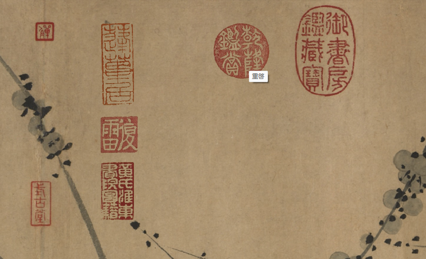

<h3 align="center">
	Chinese Seal | 中国篆印
</h3>

<h4 align="center">
	a Rainmeter skin inspired by a Chinese painting
</h4>

<h4 align="center">
    一款以<a src="https://www.si.edu/object/breath-spring%3Afsg_F1931.1">'A Breath of Spring 春消息圖'</a>為創作來源的中國風桌面插件
</h4>

## Preview | 预览

### Installation | 安裝

-   Download [Rainmeter](https://www.rainmeter.net/) | 下載[雨滴桌面](https://www.rainmeter.net/)
-   Download and run the latest `.rmskin` from [Releases](https://github.com/dev-chenxing/chinese-seal/releases) | 從[Releases](https://github.com/dev-chenxing/chinese-seal/releases)处下載并雙擊安裝最新發佈的`.rmskin` 包

### Inspiration | 來源

-   鄒復雷之名畫 ['A Breath of Spring 春消息圖'](https://www.si.edu/object/breath-spring%3Afsg_F1931.1)
